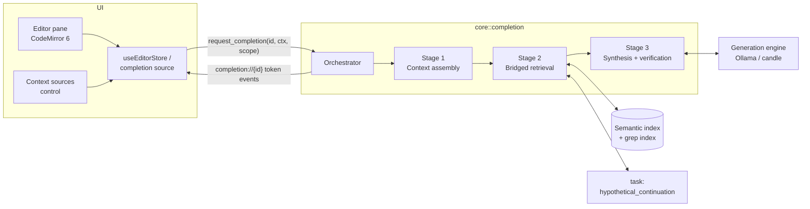

# Grounded Completion — Design

Status: implemented
Branch: `feature/editing`
Depends on: semantic index (schema v4), generation task framework, grep index, HyDE, Rocchio, Ollama engine

## 1. Purpose

Smart autocompletion for the document editor: as the user writes, Wilkes suggests
continuations grounded in the user's own library. Retrieval bridges the gap between
the half-typed natural-language prefix and the passage embedding space; a local model
synthesizes the completion from retrieved passages only; every suggestion carries
provenance back into the library.

Generation **quality is prioritized over generation speed**: prompts are built to the
model's maximum context size, and latency is managed with caching and gating rather
than by shrinking context.

### Goals

- Sentence-scale inline completions (ghost text) grounded in library passages.
- Retrieval that closes the prefix↔passage latent gap (continuation-HyDE, session
  vector, lexical anchoring) rather than embedding the raw prefix alone.
- User steering: the user can pin specific documents to prefer or restrict retrieval.
- Provenance: each shown completion links to the passages behind it; click jumps to
  the source document and page.
- Maximum-context prompting via the Ollama backend (per-model window) and the candle
  backend (32k cap).
- Instrumented from day one: show / suppress / accept / dismiss rates are logged.

### Non-goals

- Editor polish. The editor is a prerequisite; it ships minimal (buffer, save, ghost
  text plumbing) and is not part of this design's quality bar.
- Training or fine-tuning of any model (explicitly deferred).
- Chat-style drafting or long-form generation; completions are bounded at
  sentence/clause scale.
- Fallback degradation modes (no index → no completions; see §12).

## 2. Invariant

> Every completion is generated with a context block containing only passages
> retrieved from the library plus the working document, and every shown completion
> carries provenance to those passages. The retrieval query is never the raw prefix
> alone — it is always bridged into passage space first. A completion that cannot be
> verified (empty, prefix echo, degenerate, broken suffix join) is silently
> suppressed, never shown.

All stages below serve this invariant.

## 3. User experience

- **Ghost text** inline at the cursor, rendered by the editor. `Tab` accepts all,
  `⌘→` (word-forward) accepts partially, `Esc` dismisses, typing through implicitly
  dismisses.
- **Trigger**: automatic after a typing pause (see §10), or explicit via shortcut.
- **Provenance chip** in the editor status bar while a suggestion is visible: lists
  the source passages (document title, page). Clicking a source opens the document
  at that page via the existing viewer (`set_active_document`).
- **Context sources control** (steering, §8): a compact control in the editor pane
  showing the current retrieval scope — "Library" by default, or the list of pinned
  documents with a Prefer/Only mode toggle. Files removed from the context inspector
  remain visibly excluded there until restored.
- **Silent suppression**: when the verification gate rejects a candidate, the main
  UI shows nothing. No error states for low-quality generations. Suppression
  details are visible on demand in the context inspector (§5.4).
- **Status indicator**: a quiet three-state indicator (idle / searching /
  nothing-relevant) so an empty screen is never ambiguous between "no relevant
  passages", "candidate rejected", and "still computing".
- **Disabled states** are explicit: no semantic index → banner linking to indexing;
  no generation model → banner linking to the model catalog.

## 4. Architecture overview



New backend surface: a `completion` orchestrator module in `wilkes-core`, two new
generation tasks (`hypothetical_continuation`, `grounded_completion`) in
`crates/core/src/generate/tasks/`, following the existing task contract (each task
owns its prompt, its constraint, and its verification; tasks return `Err` rather
than unvalidated strings).

## 5. Frontend

### 5.1 Editor substrate (prerequisite, minimal)

- CodeMirror 6 pane hosted in the existing `ViewerTabs`, with a `useEditorStore`
  (document text, dirty state, cursor, active completion).
- Persistence: plain `save_document` command; no autosave sophistication required.
- CM6 provides the completion machinery (inline decorations for ghost text,
  invalidate-on-edit, partial accept); we implement a completion *source*, not
  completion machinery.

### 5.2 Completion source behavior

- Monotonically increasing `completionId` per request; the store drops events for
  any id other than the latest.
- Any buffer edit cancels the in-flight request (`cancel_completion`) before a new
  one is scheduled.
- While ghost text is visible, **Regenerate** dismisses it and starts a new
  request at the unchanged cursor. The editor sends the bounded history of
  suggestions already shown at that position; editing or moving the cursor
  clears that history.
- Ghost text streams in token by token; the suggestion becomes acceptable as soon
  as the first verified sentence boundary arrives (see §7.3 — verification runs on
  the completed candidate before anything is shown, so streaming is
  backend-to-store; the UI reveals the suggestion only after the gate passes).

### 5.3 Steering UI

- Pin sources: context menu on directory-tree entries, viewer tabs, and search
  results ("Pin to completion context"), plus the context sources control itself.
- Pinnable units: individual documents. (Smart collections and bookmark sets can be
  offered later as pin *sources* that expand to document lists; out of scope for the
  first slices.)
- Scope modes: **Prefer** (default when pins exist) and **Only** (§8).
- Pins are session-scoped, persisted with the editor tab state (the app already
  persists open tabs across restarts).

### 5.4 Context inspector

The provenance chip promotes to a popover that shows the full composition of the
prompt behind the current (or last) completion — context management is transparent
by inspection, not by trust:

- **Passages**: each retrieved passage with document title, page, relevance score,
  and a pinned badge where applicable; click-to-jump as in the chip.
- **Document coverage**: whether the working document was included in full or
  elided ("head + tail, middle elided"), so the user knows what the model never
  saw.
- **Scope and budget**: active scope mode, estimated window fill as tokens and a
  percentage bar (e.g. "23k / 32k · 72%"), and the document/retrieval split.
- **Source control**: each retrieved file can be excluded directly from the
  inspector. Exclusions are listed with a restore action; either change invalidates
  the current suggestion and immediately regenerates it under the new scope.
- **Session steering**: the top documents currently influencing the session vector
  (§7.2), with a **"clear session steering"** action that resets the Rocchio state.
  The session vector learns from implicit feedback (typing through a suggestion is
  a weak negative); it must therefore be inspectable and resettable, never hidden
  state the user can't account for.
- **Suppression log** (power-user section): the last few suppressed candidates with
  their rejection reasons, and the HyDE hypothetical continuation used as the dense
  query. This is where "why did nothing appear" and "why did retrieval go weird"
  get answered without polluting the main UI.

Nearly all of this data already flows through the pipeline (retrieval scores, the
budget allocator's decisions, suppression reasons from §11); the inspector reports
what would otherwise be dropped. The only new backend surface is the session-vector
query/reset pair (§6, §11).

## 6. IPC protocol

Mirrors the existing `search` / `searchId` / `cancel_search` pattern in
`ui/src/services/tauri.ts`.

```
request_completion(completionId, {
    path,               // working document
    text,               // full working document text (or delta; see §10.3)
    cursor,             // char offset
    scope: {            // steering, §8
        mode: "library" | "prefer" | "only",
        pinned: [path, ...],
        excluded: [path, ...]
    },
    avoid_suggestions: [text, ...] // bounded regeneration history
})
cancel_completion(completionId)
save_document(path, text)
```

Events on `completion://{completionId}`:

```
{ kind: "retrieval",  sources: [{path, page, chunkIds, score, pinned}, ...],
                      hydeQuery }        // empty sources ⇒ "nothing relevant"
{ kind: "context",    composition: {     // emitted at prompt assembly (§9)
                          windowTokens, usedTokens,
                          docCoverage: "full" | {headTokens, tailTokens},
                          retrievalTokens, docTokens, scopeMode } }
{ kind: "shown",      text, mode: "append" | "bridge" }
{ kind: "suppressed", reason }          // hidden in main UI; inspector shows it
{ kind: "error",      message }         // real failures only, logged
```

The status indicator (§3) is derived client-side: request in flight → "searching";
`retrieval` with empty sources or terminal `suppressed` → "nothing relevant";
otherwise idle.

Session steering surface (context inspector, §5.4):

```
get_session_steering()                  // → top contributing docs + weights
reset_session_steering()
```

Feedback (fire-and-forget, for §11):

```
completion_feedback(completionId, "accepted" | "partial" | "dismissed" | "typed_through")
```

## 7. Backend pipeline

### 7.1 Stage 1 — context assembly

- Extract prefix and suffix around the cursor. All slicing is char-boundary-aware
  (`truncate_chars` and friends); no byte indexing.
- Classify cursor mode:
  - **Append** — at end of document, or suffix within the current paragraph is
    empty. Dominant case in prose writing. Plain continuation; no infill needed.
  - **Bridge** — non-trivial suffix follows in the same paragraph/section. Infill.
- Select stop constraints from cursor mode: mid-sentence → stop at sentence end;
  sentence start → stop after 1–2 sentences; paragraph start → stop at paragraph
  end. There is no task-level output-token ceiling; generation ends at a prose
  boundary, EOS, cancellation, or the backend's context capacity.

### 7.2 Stage 2 — bridged retrieval

Three signals, fused:

1. **Continuation-HyDE** (primary dense signal). New task
   `hypothetical_continuation`: a short, low-temperature generation — "write the
   next 1–2 sentences of this passage" — from the prefix tail. The output is
   embedded with the model's query prefix and used as the dense query. The
   hypothetical continuation lives in the same declarative space as indexed
   passages, which is what closes the prefix↔passage gap. Regenerated only on
   sentence-boundary crossings; between boundaries the previous bridge vector
   remains valid.
2. **Session vector** (Rocchio). A centroid maintained over (a) paragraph
   embeddings of the working document, computed incrementally and cached, and
   (b) passages behind completions the user accepted (positive) or dismissed /
   typed through (weak negative). Blended into the dense query vector. Keeps
   retrieval on-topic when the current sentence is semantically empty
   ("Furthermore, it is…").
3. **Lexical anchor**. Grep-index lookup on the trailing content terms (named
   entities, citations, terms of art that dense retrieval smears). Fused with the
   dense ranking via reciprocal rank fusion.

Then:

- **Steering** is applied per §8 (hard filter via the semantic index's existing
  `eligible_paths` scoping, or soft boost + reserved budget).
- **Expand and merge**: hits share chunk geometry (600 chars, 128 overlap), so
  adjacent/overlapping hits from one document are stitched, then each hit is
  expanded to its surrounding paragraphs from the index's stored `full_text`,
  targeting ~1–2k tokens per passage. Chunks are the matching unit; expanded
  passages are the generation unit.
- **Rank and cut**: cosine against the blended query vector; per-document dedupe
  (soft cap, lifted for pinned documents); relevance-score **threshold** rather
  than fixed top-k — maximum context means maximum *relevant* context, and rank-40
  noise hurts more than empty budget.
- Output: ordered passages, each with `(path, page, chunk ids, score)` provenance.

### 7.3 Stage 3 — synthesis and verification

New task `grounded_completion`:

- **Prompt** assembled per the budget and layout rules in §9, through a per-model
  prompt adapter (§10.2) along two axes:
  - completion mode: `Append` (continue) | `Bridge` (infill),
  - prompt format: `InstructContinue` | `InstructInfill` | `NativeFIM`.
- **Information gain**: instructions require the candidate to advance the
  document with new information or reasoning and forbid restating or paraphrasing
  claims already present. Regeneration additionally labels the prior candidates
  the model must avoid.
- **Decoding**: existing `Constraint` machinery — stop sequences from Stage 1's
  cursor mode, hard token cap. Tokens stream from the engine; the candidate is
  verified as a whole before the UI is told to show it.
- **Regeneration diversity**: keep the quality parameters fixed and derive a new
  sampling seed from each completion id. If a candidate normalizes to a prior
  suggestion, reject it and retry at most twice with incremented seeds. Never
  raise temperature merely to force variety.
- **Verification gate** (the task's `Err` path; nothing below threshold is shown):
  - non-empty after trimming;
  - not a prefix echo (no significant overlap with the trailing prefix);
  - not degenerate (repetition detection);
  - not identical (after word normalization) to a suggestion already shown at
    this document position;
  - bridge mode: suffix join is grammatical at the boundary (cheap checks:
    capitalization/punctuation compatibility, no duplication of suffix opening);
  - grounding sanity: completions introducing named entities absent from both the
    working document and the retrieved passages are suppressed (conservative
    hallucination screen).
- Every outcome — shown or suppressed with reason — is logged (§11).

## 8. Steering: pinned documents

The user can steer retrieval toward specific documents. Semantics:

| Mode | Meaning | Mechanism |
|---|---|---|
| `library` | No pins; whole corpus eligible. | Default retrieval. |
| `prefer` | Pins bias but don't restrict. | Score boost (multiplicative, on the fused ranking) **plus** a reserved share of the retrieval token budget (~half) guaranteed to the pinned documents' best passages; each pinned document contributes at least one expanded passage if it clears a floor score. Unused reserve flows back to the general pool. |
| `only` | Hard restriction. | Pinned set passed as `eligible_paths` to the semantic index (existing scoping path, already used by search); grep-index lookups filtered to the same set. |

Notes:

- `prefer` is the default mode the moment the first pin is added; the user can
  toggle to `only` in the context sources control.
- Pins are an explicit signal and deliberately kept separate from the implicit
  Rocchio session vector: pins gate/boost *eligibility and budget*, the session
  vector shapes *ranking*. Removing a pin immediately removes its effect; the
  session vector decays on its own schedule.
- Pinning a document does not bypass the relevance floor — a pinned document with
  nothing relevant to the current sentence contributes nothing (visible in the
  provenance chip, which is how the user learns the pin isn't helping).
- Excluded documents are removed before dense top-k selection and from lexical
  retrieval in every scope mode. Dense retrieval widens its candidate request only
  when filtering leaves too few results, rather than scanning the full corpus for
  every exclusion. Pinning an excluded document restores it; excluding a pinned
  document removes its pin. The two lists are therefore never allowed to express
  contradictory steering.

## 9. Context budget and prompt assembly

Quality-first: prompts are built to the model's maximum window, managed rather than
minimized.

### 9.1 Window discovery

- **Ollama engine**: read the model's context length from `/api/show` at model-load
  time and set `num_ctx` explicitly on every request. Ollama's default `num_ctx` is
  small (2–4k) and silently truncates — relying on "the model's max" requires
  setting it. The memory consequence of large windows (KV cache can reach many GB
  at 128k) is surfaced as a user-visible setting with the model-max as default,
  never a silent choice.
- **candle engine**: existing `context_tokens` cap (32,768) is the window.

### 9.2 Budget allocation

Off the top: output reserve (~300 tokens) and task instructions (~400). The
remainder splits **50/50 between working document and retrieved passages**, each
side's unused budget flowing to the other.

| Window | Instructions | Working doc | Retrieval | ≈ expanded passages |
|---|---|---|---|---|
| 8k | ~400 | ~3.5k | ~3.5k | 2–3 |
| 32k (candle cap) | ~400 | ~15k | ~15k | 8–12 |
| 128k | ~400 | full doc, almost always | 40k+ | 20–30, threshold-capped |

With pins in `prefer` mode, ~half the retrieval share is reserved for pinned
documents (§8).

### 9.3 Layers

1. **Task instructions** (~400 tokens): mode-specific directive, grounding rule
   ("prefer facts from the labeled source passages"), output constraints.
2. **Retrieved passages**: expanded passages (§7.2), each prefixed with a source
   label (`[Source: {title}, p.{page}]`), ordered relevance-*ascending* so the
   strongest passages sit nearest the working document. Before admission, a
   deterministic text-quality gate rejects chunks dominated by numeric cells or
   compact layout labels and removes such lines from otherwise useful expanded
   passages. Statistical prose and figure captions remain eligible; raw figure
   grids do not. This gate is completion-only, requires no model call or index
   rebuild, and leaves exact and semantic search content unchanged.
3. **Working document**: full text when it fits. When it doesn't: keep the head
   (the opening fixes topic and register) plus the largest possible tail; elide the
   middle at paragraph boundaries with an explicit `[...]` marker. Never cut
   mid-sentence; all cuts at char boundaries. Bridge mode includes the suffix,
   labeled, with the prefix tail adjacent to the insertion point.
4. **Steering residue** (small): source attributions of the last few accepted
   completions, for consistency with commitments already made.

### 9.4 Ordering rationale

Prompt order: **instructions → passages (best last) → working document (ends at
cursor)**. Two independent reasons converge:

- *Lost-in-the-middle*: models attend best to the edges — instructions at the head,
  the strongest passages and the text being continued at the tail; weaker passages
  buried where degradation is cheapest.
- *KV-cache economics*: in append mode the user only adds characters at the end, so
  the prompt changes append-only across ticks — Ollama's prompt cache and candle's
  KV reuse pay only the delta. Re-retrieval invalidates from the passage block
  onward, which is why retrieval refreshes only on boundary crossings (§10.1).

Prompt assembly is deterministic given (document text, cursor, passage set, scope):
identical states rebuild identical prompts, which is also what makes caching work.

## 10. Latency and caching

Quality-first accepts a beat of latency after finishing a sentence; it does not
accept lag while typing mid-sentence.

### 10.1 Gating

- **Speculative retrieval** on a short debounce (~150 ms): Stage 2 runs so the
  passage set is warm.
- **Gated synthesis** on a real pause (~400–500 ms) or explicit trigger: Stage 3
  runs. First prefill after a retrieval refresh is the expensive step (15–30k+
  tokens → seconds); append-case ticks between refreshes pay only the delta.
- **Boundary-gated re-retrieval**: Stage 2 re-runs (and HyDE regenerates) only on
  sentence/paragraph-boundary crossings, not every tick.

### 10.2 Single-flight and cancellation

One in-flight completion per editor. A keystroke cancels it end-to-end — the
generation worker already supports mid-stream cancellation
(`cancel_active_request`); the orchestrator propagates cancellation to retrieval
and HyDE as well.

### 10.3 Caches (session-scoped)

- Paragraph embeddings of the working document (incremental; feeds the session
  vector).
- The expanded-passage set and assembled prompt prefix, per retrieval boundary.
- HyDE bridge vector, per sentence boundary.
- Document text can be sent as delta once the spine works; full text per request is
  acceptable for slice 1 (IPC cost is trivial next to prefill).

## 11. Feedback and instrumentation

First-class from slice 1 — the suppression threshold is the product's main quality
dial, and it is tuned from this data:

- Log every candidate outcome: `shown | suppressed(reason)`, and every user
  verdict: `accepted | partial | dismissed | typed_through`, with completion mode,
  prompt format, scope mode, retrieval scores, model, and timings
  (`GenerationTimings` already exists).
- Log every attached generator request at info level with the exact system text,
  prompt, constraints, token cap, and sampling settings. This deliberately logs
  working-document and retrieved-passage content so local diagnostics reproduce
  the actual model input.
- Accepted → strong positive Rocchio update from the completion's source passages;
  dismissed / typed-through → weak negative.
- These logs are what later decide: the suppression threshold, `InstructInfill`
  vs `NativeFIM` on bridge cases (A/B, §13), and whether pinned-reserve sizing is
  right.
- **Session steering is user-visible state**: the Rocchio accumulator exposes a
  query surface (`get_session_steering` — top contributing documents and weights)
  and a reset (`reset_session_steering`), consumed by the context inspector
  (§5.4). Because the vector learns from implicit signals, inspectability and
  resettability are requirements, not conveniences.
- The last few suppressed candidates (with reasons) and the current HyDE query are
  retained per session for the inspector's suppression log — instrumentation
  doubles as user-facing transparency.

## 12. Failure posture

Per the project's no-fallback rule:

- No semantic index → completions **off**, explicit UI state linking to indexing.
- No generation model → completions **off**, linking to the model catalog.
- Ollama configured but unreachable → completions off with the transport error
  surfaced; no silent switch to candle.
- Retrieval returns nothing above threshold → no completion this tick (logged);
  never generation-without-grounding.
- All suppressions and errors logged; nothing swallowed.

## 13. Model policy

- **Primary**: strong general instruct model. Prose completions live and die on
  register, and FIM-capable models are code-trained; instruct prompting wins on
  prose. Append mode needs no FIM at all; bridge mode uses instruct-infill with the
  verification gate covering loose suffix adherence.
- Qwen3 instruct (already in the candle stack) works from slice 1; the Ollama
  backend opens the catalog (Gemma-class and larger instruct models) without new
  candle families.
- **`NativeFIM`** stays a supported prompt format. Once instrumentation has volume,
  run a code-FIM model (e.g. Qwen2.5-Coder-7B) as an A/B baseline on bridge cases
  only — the one place native FIM might earn its seat — and decide on acceptance
  rates, not vibes.

## 14. Delivery plan — vertical slices

Each slice is end-to-end and shippable; none is throwaway.

1. **Spine** — minimal CM6 editor + `save_document`; IPC protocol; pipeline with
   raw-prefix dense retrieval only → expand/merge → instruct-mode synthesis →
   verification gate → streaming ghost text + provenance chip; instrumentation
   logging; explicit disabled states. *Grounded completion works, unbridged and
   unsteered.*
2. **Bridging + steering + transparency** — `hypothetical_continuation` task;
   Rocchio session vector wired to accept/dismiss feedback; lexical RRF; pinned
   documents (`prefer`/`only`) end-to-end: pin UI → scope in protocol →
   boost/filter in retrieval → reserved budget in assembly. Context inspector
   (§5.4) with the `context` event, session-steering query/reset, status
   indicator, and suppression log — it ships in the same slice as the machinery it
   makes visible (pins and the session vector share its surfaces). *Retrieval gets
   smart, steerable, and inspectable.*
3. **Quality-max context + hardening** — Ollama `num_ctx` discovery and
   full-window budgeting; KV-stable layout with boundary-gated re-retrieval;
   partial accept; typed-through negative feedback; suppression-threshold tuning
   from slice-1 logs.

Deferred beyond these slices: `NativeFIM` A/B (needs slice-3 volume), collection-
and bookmark-set pins, per-document pin persistence, learned alignment head
(training — explicitly out of scope).

## 15. Risks

| Risk | Exposure | Mitigation |
|---|---|---|
| Instruct models follow the suffix loosely in bridge mode | Visible "didn't respect what follows" moments | Suffix-join verification; bridges are the minority case; `NativeFIM` A/B as escape hatch |
| First prefill after boundary refresh takes seconds at 32k+ | Perceived lag after finishing a sentence | KV-stable ordering; boundary gating; speculative retrieval; user expectation set by ghost-text idiom |
| Large `num_ctx` memory blowup on big models | OOM / swap on consumer machines | Explicit user-visible window setting; surfaced memory estimate at model load |
| Over-suppression makes the feature feel absent | Low show rate | Threshold tuned from instrumentation, not guessed; suppression reasons logged from slice 1 |
| Noise from over-stuffed retrieval degrades output | Generic or off-topic completions despite big windows | Score threshold instead of fixed top-k; per-document dedupe; pin floor score |
| CM6 is a new dependency and the editor decision is expensive to reverse | Rework if editing later moves elsewhere | Flagged at design time; completion source is substrate-agnostic behind the store/IPC boundary |
